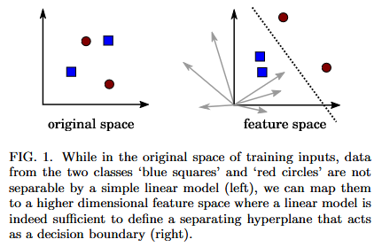
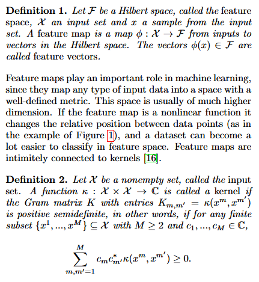
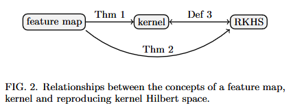

# IAcob

## Informations générales
- **Titre complet du projet :** Exploration et mise en œuvre de techniques de machine learning quantiques (e.g. Kernel methods: SVM)
- **Objectifs du projet :**
  - Comprendre les méthodes de machine learning quantiques en partant de l'article initial et en progressant le plus loin possible dans leur compréhension.
  - Produire un rapport clair et précis sur la méthode, en comprenant chaque étape.
  - Considérer la version non quantique de la méthode comme point de départ si nécessaire.
  - Transmettre régulièrement des notes sur la progression du projet pour suivi.
- **Objectifs secondaires :**
  - Si le temps le permet, implémenter la méthode sur des données de petite taille.
  - Tout expliquer de tel sorte à ce que ma mère puisse comprendre (mission impossible).

 

## Consignes
“Les articles donnés sont juste pour démarrer. N'hésitez pas à rechercher d'autres sources (en référence ou autre).

Le but du TER est de progresser le plus loin possible dans la compréhension de la méthode en partant de l'article afin de produire un rapport qui présente la méthode de manière claire et précise. 
Chacune de ses étapes doit être comprise. 
N'hésitez pas à partir de la version non quantique de la méthode. 
Si vous avez le temps, faites une implémentation basique sur des données de petite taille.

Si possible, transmettez-moi régulièrement vos notes afin que je puisse suivre votre progression.”

 

## Articles

**"Quantum machine learning in feature Hilbert spaces"**
[(source)](./Quantum%20machine%20learning%20in%20feature%20Hilbert%20spaces.pdf)
- ==> I. Introduction
  - Cet article explore la connexion entre l'informatique quantique et les "méthodes à noyau" (kernel methods) en Machine Learning, mettant en évidence leurs similitudes dans la réalisation de calculs dans des espaces de Hilbert de grande taille.
  - Il propose deux approches pour construire des algorithmes de Machine Learning quantique :
    1. Utilisation d'un dispositif quantique pour l'estimation des produits scalaires associés à un kernel difficile à traiter classiquement.
    2. L'autre utilisant un "circuit quantique variationnel" comme modèle linéaire pour classifier les données dans l'espace de Hilbert.
- ==> II. Feature maps, kernels and quantum computing
- Les kernel methods utilisent une mesure de distance κ(x, x′) entre deux entrées quelconques x, x′ ∈ X afin de construire des modèles qui capturent les propriétés d'une distribution de données. Cette mesure de distance est liée aux produits scalaires dans un certain espace, l'espace des caractéristiques. Il y a beaucoup d'applications mais la plus célèbre est le SVM.
- A. Feature maps and kernels
  - Définition 1. Soit F un espace de Hilbert, appelé l'espace des caractéristiques (feature space), X un ensemble d'entrées et x un échantillon de l'ensemble d'entrées. Une carte de caractéristiques (feature map) est une application φ : X → F des entrées vers des vecteurs dans l'espace de Hilbert. Les vecteurs φ(x) ∈ F sont appelés vecteurs de caractéristiques (feature vectors).
  - Définition 2. Soit X un ensemble non vide, appelé l'ensemble d'entrées. Une fonction κ : X × X → C est appelée un noyau (kernel) si la matrice de Gram K avec les entrées Km,m′ = κ(xm, xm′) est semi-définie positive, c'est-à-dire si pour tout sous-ensemble fini {x1, ..., xM} ⊆ X avec M ≥ 2 et c1, ..., cM ∈ C, M∑m,m′=1 cmc∗m′ κ(xm, xm′) ≥ 0.
  -  
  - ***Voir les formules sur l'article.***
  - La connexion entre les feature maps et les kernels signifie que chaque feature map correspond à une mesure de distance dans l'espace d'entrée par le biais du produit interne des feature vectors. Cela signifie également que nous pouvons calculer les produits internes de vecteurs mappés dans des espaces de dimension beaucoup plus élevée en calculant une fonction kernel, ce qui peut être beaucoup plus facile sur le plan computationnel.
- B. Reproducing kernel Hilbert spaces
  - La théorie des noyaux va plus loin et définit un espace de Hilbert unique associé à chaque kernel, l'espace de Hilbert à kernel reproduisant ou RKHS [17, 18]. Bien qu'assez abstrait, ce concept est utile pour comprendre l'importance des kernels pour le Machine Learning, ainsi que leur connexion aux modèles linéaires dans le feature space.
  - Définition 3. ***Voir l'article.***
  - Puisqu'une feature map donne lieu à un kernel et qu'un kernel donne lieu à un espace de Hilbert à kernel reproduisant, nous pouvons construire un espace de Hilbert à kernel reproduisant unique pour toute feature map donnée 
  - Le théorème de représentation implique que pour une famille commune de problèmes d'optimisation de Machine Learning sur des fonctions dans un espace de Hilbert à noyau reproduisant (RKHS) R, la solution peut être représentée comme une expansion de fonctions noyau. Cela permet de résoudre le problème d'optimisation convexe pour trouver les paramètres αm. La combinaison des théorèmes 2 et 3 montre un autre aspect du lien entre les noyaux et les feature maps.
- C. Input encoding as a feature map
  - L'approche immédiate pour combiner la mécanique quantique et la théorie des noyaux est d'associer l'espace de Hilbert d'un système quantique à un espace de Hilbert à noyau reproduisant et de trouver le noyau reproduisant du système. Nous montrons dans l'Appendice A que pour les espaces de Hilbert à bases discrètes, ainsi que pour le cas spécial de l'espace de Hilbert des états cohérents à base continue, le noyau reproduisant est donné par les produits scalaires des vecteurs de base.
  - Cette idée peut conduire à des résultats intéressants. Par exemple, Chatterjee et al. [14] montrent que le produit scalaire d'un état cohérent optique peut être transformé en un noyau gaussien (également appelé noyau de fonction de base radiale) qui est largement utilisé dans l'apprentissage automatique.
  - Cependant, pour élargir le cadre, nous choisissons une autre voie ici. Au lieu de demander quel noyau est associé à un espace de Hilbert quantique, nous associons un espace de Hilbert quantique à un espace de caractéristiques et dérivons un noyau qui est donné par le produit scalaire des états quantiques. Comme vu dans la section précédente, cela donnera automatiquement lieu à un espace de Hilbert à noyau reproduisant, et tout l'appareil de la théorie des noyaux peut être appliqué.
  - Supposons que nous voulions encoder une entrée x à partir d'un ensemble d'entrées X dans un état quantique décrit par un vecteur |φ(x)〉 et qui vit dans l'espace de Hilbert F. Cette procédure d'« encodage d'entrée » remplit la définition d'une carte de caractéristiques φ : X → F, que nous appelons une carte de caractéristiques quantique ici.
  - Selon le Théorème 1, nous pouvons dériver un noyau κ à partir de cette carte de caractéristiques via l'Équation (1).
  - Par vertu du Théorème 2, le noyau est le noyau reproduisant d'un espace de Hilbert à noyau reproduisant Rκ tel que défini dans l'Équation (3).
  - Les fonctions dans Rκ sont les produits scalaires des données d'entrée « cartographiées » et un vecteur |w〉 ∈ F, qui définit un modèle linéaire f(x; w) = 〈w|φ(x)〉.
  - Notez que nous utilisons des crochets de Dirac 〈·| · 〉 au lieu du produit scalaire 〈·, ·〉 pour signifier que nous calculons des produits scalaires dans un espace de Hilbert quantique.
  - Enfin, le théorème de représentation garantit que le minimiseur de la perte empirique peut être exprimé par l'Équation (4).
  - L'idée simple d'interpréter x → |φ(x)〉 comme une carte de caractéristiques nous permet donc d'utiliser la riche théorie des méthodes à noyaux et donne lieu à des modèles d'apprentissage automatique dont les candidats formés peuvent être exprimés par des produits scalaires d'états quantiques.
  - Notez que si l'état |φ(x)〉 a des amplitudes complexes, nous pouvons toujours construire un noyau réel en prenant le carré absolu du produit scalaire.
  - ***Voir les formules sur l'article.***
- ==> III. Quantum machine learning in feature Hilbert space
- A. Feature-encoding circuits
  - TODO
- B. Building a quantum classifier
  - TODO
- C. Squeezing as a feature map
  - TODO
- D. An implicit quantum-assisted classifier
  - TODO
- E. An explicit quantum classifier
  - TODO
- ==> IV. Conclusion

 

**"Nom de l'article"**
[(source)](./link_to_the_article.pdf)
- Description de l'article
- ==> Résultats de l'article
- ==> Conclusion de l'article

 

**"Nom de l'article"**
[(source)](./link_to_the_article.pdf)
- Description de l'article
- ==> Résultats de l'article
- ==> Conclusion de l'article

 

